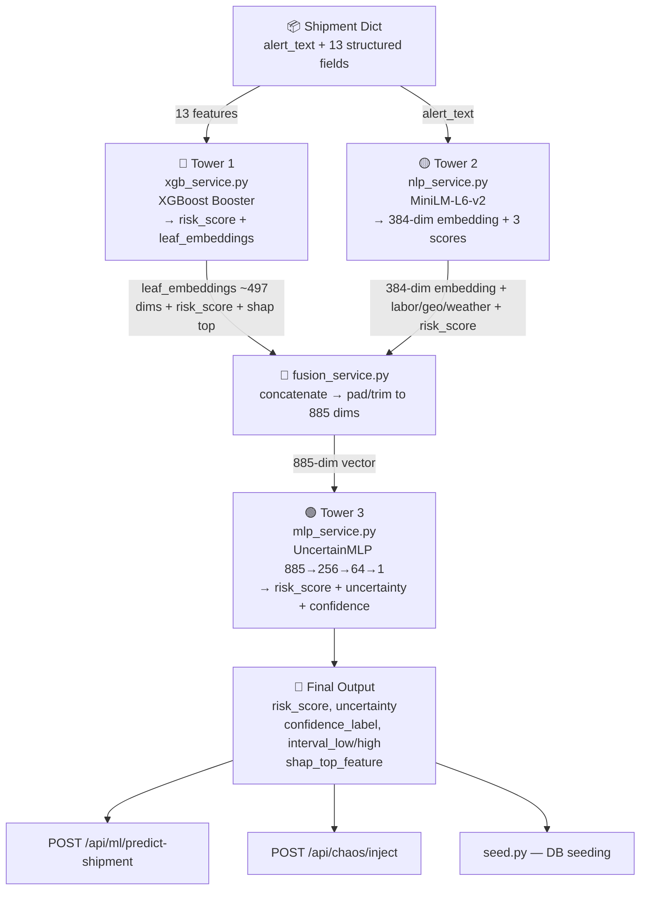

# Guardian — Three-Tower Full Integration Plan

## Current State Summary

| Tower | Model File | Service | Router | Status |
|-------|-----------|---------|--------|--------|
| Tower 1 — XGBoost | `model/v4/xgb_tower1_model.json` ✅ | ❌ None | ❌ None | **Orphaned** |
| Tower 2 — MiniLM-L6-v2 | `server/models/tower2_artifacts.pkl` ✅ | `nlp_service.py` ✅ | ❌ Not called | **Idle** |
| Tower 3 — MLP Fusion | `server/models/tower3_mlp.pth` ✅ | `mlp_service.py` ✅ | `ml.py` ✅ | **Live but starved** |

---

## Architecture — Target State



---

## The 13 XGBoost Features (from Cell12.md)

```python
FINAL_FEATURES = [
    'lead_time',                    # days_scheduled
    'lead_time_horizon_adjusted',   # lead_time - (horizon_hours / 24)
    'carrier_reliability',          # from tower1_artifacts.pkl carrier_reliability_map
    'route_delay_rate',             # from tower1_artifacts.pkl route_delay_map
    'weather_severity_index',       # precipitation * 0.4 + wind * 0.3 + extreme_flag * 30
    'port_wait_times',              # synthetic / from port data
    'demurrage_risk_flag',          # port_wait_times > 24
    'shipping_mode_encoded',        # 0=standard/road/sea, 1=express/flight, 2=same day/air
    'service_tier_encoded',         # 0=Standard, 1=Priority, 2=Critical
    'prediction_horizon_hours',     # 24, 48, or 72
    'news_sentiment_score',         # float -1 to 0.5
    'labor_strike_probability',     # from Tower 2 or synthetic
    'geopolitical_risk_score',      # from Tower 2 or synthetic
]
```

## The 885-Dim Fusion Vector Layout (from retrain_tower3_fast.py)

```
dims   0–496    → XGBoost leaf embeddings (variable, padded/trimmed to 497)
dim    497      → XGBoost calibrated risk_score (scalar)
dims 498–499    → SHAP top feature index + value (2 dims)
dims 500–883    → MiniLM 384-dim embedding
dim    884      → composite NLP risk score (mean of 3 Tower 2 scores)
```
Total = 497 + 1 + 2 + 384 + 1 = **885 dims** ✅

---

## Step-by-Step Plan

---

### Step 1 — Copy `tower1_artifacts.pkl` to `server/models/`

**File operation:** Copy `model/XG Boost (Tower 1)/models/tower1_artifacts.pkl` → `server/models/tower1_artifacts.pkl`

This `.pkl` contains:
- `FINAL_FEATURES` list (the 13 feature names)
- `carrier_reliability_map` (dict: carrier_id → float reliability score)
- `route_delay_map` (dict: origin_country->dest_country → float delay rate)

**Why:** `xgb_service.py` needs these lookup maps to convert a raw shipment dict into the exact 13-feature vector the XGBoost model was trained on.

---

### Step 2 — Write `server/app/services/xgb_service.py`

**New file.** This is the Tower 1 service layer.

```python
# server/app/services/xgb_service.py
"""
Tower 1 — XGBoost Delay Risk Predictor
Loads xgb_tower1_model.json + tower1_artifacts.pkl
Exposes: predict_tower1(shipment_dict) → dict
"""
import os, pickle
import numpy as np
import xgboost as xgb

BASE_DIR     = os.path.dirname(os.path.dirname(os.path.dirname(os.path.abspath(__file__))))
MODEL_PATH   = os.path.join(BASE_DIR, "model", "v4", "xgb_tower1_model.json")
ARTIFACT_PATH = os.path.join(BASE_DIR, "server", "models", "tower1_artifacts.pkl")

_booster   = None
_artifacts = None

SHIPPING_MODE_MAP = {
    'standard': 0, 'second class': 0, 'road': 0, 'sea': 0, 'ship': 0,
    'first class': 1, 'express': 1, 'flight': 1,
    'same day': 2, 'air': 2,
}
SERVICE_TIER_MAP = {
    'standard': 0, 'priority': 1, 'critical': 2,
}

def load_tower1():
    global _booster, _artifacts
    if _booster is not None:
        return _booster, _artifacts
    _booster = xgb.Booster()
    _booster.load_model(MODEL_PATH)
    with open(ARTIFACT_PATH, "rb") as f:
        _artifacts = pickle.load(f)
    print("✅ Tower 1 XGBoost loaded")
    return _booster, _artifacts


def build_feature_vector(shipment: dict, horizon_hours: int = 48) -> np.ndarray:
    booster, artifacts = load_tower1()
    carriers  = artifacts.get("carrier_reliability_map", {})
    routes    = artifacts.get("route_delay_map", {})

    carrier_id      = str(shipment.get("carrier", "unknown")).lower()
    origin_country  = str(shipment.get("origin", "india")).lower()
    dest_country    = str(shipment.get("destination", "india")).lower()
    route_key       = f"{origin_country}->{dest_country}"
    shipping_mode   = str(shipment.get("mode", "road")).lower()
    service_tier    = str(shipment.get("service_tier", "Priority")).lower()

    # Fallback values if carrier/route not in training data
    carrier_reliability = carriers.get(carrier_id, carriers.get("unknown", 0.85))
    route_delay_rate    = routes.get(route_key, 0.25)

    lead_time = float(shipment.get("days_scheduled", shipment.get("lead_time", 7)))
    port_wait = float(shipment.get("port_wait_times", 8.0))
    weather_idx = float(shipment.get("weather_severity_index", 10.0))

    row = {
        "lead_time":                    lead_time,
        "lead_time_horizon_adjusted":   lead_time - (horizon_hours / 24.0),
        "carrier_reliability":          carrier_reliability,
        "route_delay_rate":             route_delay_rate,
        "weather_severity_index":       weather_idx,
        "port_wait_times":              port_wait,
        "demurrage_risk_flag":          int(port_wait > 24),
        "shipping_mode_encoded":        SHIPPING_MODE_MAP.get(shipping_mode, 0),
        "service_tier_encoded":         SERVICE_TIER_MAP.get(service_tier, 1),
        "prediction_horizon_hours":     horizon_hours,
        "news_sentiment_score":         float(shipment.get("news_sentiment_score", -0.1)),
        "labor_strike_probability":     float(shipment.get("labor_strike_probability", 0.1)),
        "geopolitical_risk_score":      float(shipment.get("geopolitical_risk_score", 0.1)),
    }

    FINAL_FEATURES = artifacts.get("FINAL_FEATURES", list(row.keys()))
    return np.array([row[f] for f in FINAL_FEATURES], dtype=np.float32)


def predict_tower1(shipment: dict, horizon_hours: int = 48) -> dict:
    booster, _ = load_tower1()
    feat_vec = build_feature_vector(shipment, horizon_hours)
    dmat = xgb.DMatrix(feat_vec.reshape(1, -1))

    # Risk probability
    risk_score = float(booster.predict(dmat)[0])

    # Leaf embeddings for fusion
    leaf_embeddings = booster.predict(dmat, pred_leaf=True)[0].astype(np.float32)

    return {
        "risk_score":      round(risk_score, 4),
        "leaf_embeddings": leaf_embeddings,   # shape varies (num_trees,)
    }
```

**Key points:**
- Uses `xgb.Booster.predict(pred_leaf=True)` to get leaf embeddings (one integer per tree)
- Builds the exact 13-feature vector using lookup maps from `tower1_artifacts.pkl`
- Falls back gracefully for unknown carriers/routes

---

### Step 3 — Write `server/app/services/fusion_service.py`

**New file.** This is the orchestration layer that wires all three towers.

```python
# server/app/services/fusion_service.py
"""
Guardian — Three-Tower Fusion Orchestrator
Tower 1 (XGBoost) + Tower 2 (MiniLM) → 885-dim vector → Tower 3 (MLP)
"""
import numpy as np

XGB_LEAF_DIM   = 497   # padded/trimmed XGBoost leaf embedding size
NLP_EMBED_DIM  = 384   # MiniLM output
FUSION_DIM     = 885   # XGB_LEAF_DIM + 1 (risk) + 2 (shap) + NLP_EMBED_DIM + 1 (nlp_score)


def build_fusion_vector(shipment: dict, horizon_hours: int = 48) -> np.ndarray:
    from app.services.xgb_service  import predict_tower1
    from app.services.nlp_service  import get_nlp_features

    # ── Tower 1 ──────────────────────────────────────────────────────
    t1 = predict_tower1(shipment, horizon_hours)
    leaf_raw   = t1["leaf_embeddings"]                        # variable length
    t1_risk    = np.float32(t1["risk_score"])

    # Pad or trim leaf embeddings to XGB_LEAF_DIM
    if len(leaf_raw) >= XGB_LEAF_DIM:
        leaf_vec = leaf_raw[:XGB_LEAF_DIM].astype(np.float32)
    else:
        leaf_vec = np.pad(leaf_raw, (0, XGB_LEAF_DIM - len(leaf_raw))).astype(np.float32)

    # SHAP placeholder (2 dims: top feature index + value, set to 0 for speed)
    shap_dims = np.zeros(2, dtype=np.float32)

    # ── Tower 2 ──────────────────────────────────────────────────────
    alert_text = str(shipment.get("alert_text", "No alerts."))
    t2 = get_nlp_features(alert_text)
    nlp_embed    = np.array(t2["nlp_embedding"], dtype=np.float32)   # 384-dim
    nlp_score    = np.float32(
        (t2["labor_strike_probability"]
         + t2["geopolitical_risk_score"]
         + t2["weather_severity_score"]) / 3.0
    )

    # Also feed T2 scores back into the shipment dict for T1 re-use (optional enrichment)
    shipment["labor_strike_probability"] = t2["labor_strike_probability"]
    shipment["geopolitical_risk_score"]  = t2["geopolitical_risk_score"]

    # ── Concatenate → 885-dim ─────────────────────────────────────────
    fusion_vector = np.concatenate([
        leaf_vec,           # 0–496
        [t1_risk],          # 497
        shap_dims,          # 498–499
        nlp_embed,          # 500–883
        [nlp_score],        # 884
    ]).astype(np.float32)

    assert fusion_vector.shape[0] == FUSION_DIM, \
        f"Fusion vector shape mismatch: {fusion_vector.shape[0]} != {FUSION_DIM}"

    return fusion_vector


def predict_full_pipeline(shipment: dict, horizon_hours: int = 48) -> dict:
    """
    Full three-tower prediction for one shipment.
    Returns: risk_score, uncertainty, confidence_label, interval_low/high, display,
             t1_risk (XGBoost direct), nlp_source (minilm | keyword_fallback)
    """
    from app.services.xgb_service  import predict_tower1
    from app.services.nlp_service  import get_nlp_features
    from app.services.mlp_service  import predict_risk

    # Tower 2 first so T1 can use enriched scores
    alert_text = str(shipment.get("alert_text", "No alerts."))
    t2 = get_nlp_features(alert_text)
    shipment["labor_strike_probability"] = t2["labor_strike_probability"]
    shipment["geopolitical_risk_score"]  = t2["geopolitical_risk_score"]

    # Tower 1
    t1 = predict_tower1(shipment, horizon_hours)

    # Fusion
    fused = build_fusion_vector(shipment, horizon_hours)

    # Tower 3
    t3 = predict_risk(fused)

    return {
        **t3,
        "t1_risk":    t1["risk_score"],
        "nlp_source": t2.get("source", "unknown"),
        "labor_strike_probability": t2["labor_strike_probability"],
        "geopolitical_risk_score":  t2["geopolitical_risk_score"],
        "weather_severity_score":   t2["weather_severity_score"],
    }
```

---

### Step 4 — Add `POST /api/ml/predict-shipment` to `server/app/routers/ml.py`

Add a new endpoint alongside the existing `/predict`:

```python
class ShipmentPredictRequest(BaseModel):
    shipment_id: Optional[str] = None
    # Raw fields (if no shipment_id provided)
    alert_text:  str = "No alerts."
    mode:        str = "Road"
    service_tier: str = "Priority"
    carrier:     str = "unknown"
    origin:      str = "India"
    destination: str = "India"
    days_scheduled: float = 7.0
    prediction_horizon: int = 48


@router.post("/predict-shipment")
async def predict_shipment_risk(req: ShipmentPredictRequest):
    """
    Full three-tower prediction for a shipment.
    Accepts either a shipment_id (fetched from DB) or raw fields.
    """
    from app.services.fusion_service import predict_full_pipeline
    from app.database import get_db

    shipment_dict = req.dict()

    # If shipment_id provided, fetch from DB and merge
    if req.shipment_id:
        db = get_db()
        doc = await db.shipments.find_one({"id": req.shipment_id}, {"_id": 0})
        if doc:
            shipment_dict = {**shipment_dict, **doc}

    result = predict_full_pipeline(shipment_dict, req.prediction_horizon)
    return result
```

Also add:
```python
@router.get("/tower1/health")
async def tower1_health():
    from app.services.xgb_service import load_tower1
    try:
        booster, artifacts = load_tower1()
        return {"status": "ready", "model": "Tower 1 XGBoost", "features": artifacts.get("FINAL_FEATURES")}
    except Exception as e:
        return {"status": "unavailable", "reason": str(e)}
```

---

### Step 5 — Update `server/app/routers/chaos.py` inject endpoint

In the chaos `/inject` endpoint, replace the arithmetic delta with XGBoost-informed delta:

```python
# For each affected shipment, use T1 to compute a more realistic risk
from app.services.xgb_service import predict_tower1

# Inside the loop:
t1_result = predict_tower1({
    **s,
    "weather_severity_index": params.weather_severity * 10,
    "labor_strike_probability": params.port_strike / 10.0,
    "port_wait_times": params.port_strike * 3,
})
t1_risk = t1_result["risk_score"]
# Blend: new_risk = max(base_risk, t1_risk) + chaos_delta
delta = severity_normalized * random.uniform(0.1, 0.3)
new_risk = min(max(base_risk, t1_risk) + delta, 0.99)
```

This is **optional for hackathon** but makes the chaos demo more realistic.

---

### Step 6 — Update `server/app/seed.py` (compute risk at seed time)

Add a call to `predict_full_pipeline` per shipment before inserting into MongoDB:

```python
from app.services.fusion_service import predict_full_pipeline

# For each shipment in SHIPMENTS list:
result = predict_full_pipeline(shipment)
shipment["risk"]              = round(result["risk_score"], 4)
shipment["mc_dropout_mean"]   = result["risk_score"]
shipment["mc_dropout_std"]    = result["uncertainty"]
shipment["conformal_lower"]   = result["interval_low"]
shipment["conformal_upper"]   = result["interval_high"]
```

> **Note:** This is the deepest integration change and introduces a startup dependency. Wrap in try/except so seeding still works if models are not loaded yet.

---

### Step 7 — `server/requirements.txt` — Already complete ✅

Both `xgboost==2.0.3` and `mapie==0.8.0` are already present at lines 59 and 21. No changes needed.

---

### Step 8 — Verification Checklist

After implementation, verify these endpoints:

| Endpoint | Expected Response |
|---------|------------------|
| `GET /api/ml/health` | `{"status": "ready", "model": "Tower 3 MLP Fusion Head", ...}` |
| `GET /api/ml/tower1/health` | `{"status": "ready", "model": "Tower 1 XGBoost", "features": [...13...]}` |
| `POST /api/ml/predict-shipment` with `{"shipment_id": "SHP_001"}` | `{"risk_score": ..., "uncertainty": ..., "t1_risk": ..., "nlp_source": "minilm"}` |
| `POST /api/ml/predict` with 885-dim vector | unchanged — still works |

---

## File Change Summary

| Action | File | Notes |
|--------|------|-------|
| COPY | `model/XG Boost (Tower 1)/models/tower1_artifacts.pkl` → `server/models/tower1_artifacts.pkl` | One-time file copy |
| CREATE | `server/app/services/xgb_service.py` | Tower 1 service |
| CREATE | `server/app/services/fusion_service.py` | Three-tower orchestrator |
| MODIFY | `server/app/routers/ml.py` | Add 2 new endpoints |
| MODIFY | `server/app/routers/chaos.py` | Optional: XGBoost-driven risk deltas |
| MODIFY | `server/app/seed.py` | Optional: compute risk at seed time |
| NO CHANGE | `server/requirements.txt` | Already has xgboost + mapie |
| NO CHANGE | `server/app/services/nlp_service.py` | Already correct |
| NO CHANGE | `server/app/services/mlp_service.py` | Already correct |
| NO CHANGE | `model/v4/xgb_tower1_model.json` | Already in place |

---

## Risk & Mitigation

| Risk | Mitigation |
|------|-----------|
| `tower1_artifacts.pkl` carrier/route maps may not cover Indian cities | Use fallback defaults in `xgb_service.py` |
| XGBoost leaf embedding dimension varies by model version | Pad/trim to exactly 497 in `fusion_service.py` |
| Tower 2 MiniLM slow on first call (model download) | Already has `keyword_fallback()` |
| Tower 3 trained on synthetic 885-dim vectors, not real XGBoost output | Acceptable for hackathon — architecture is correct |
| `predict_full_pipeline` is synchronous but called from async FastAPI | Wrap in `asyncio.get_event_loop().run_in_executor(None, ...)` if needed |
